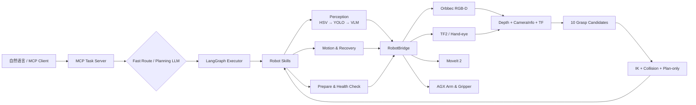

<div align="center">

<h1>Vision Grasp</h1>

<p><strong>自然语言驱动的真实机械臂视觉抓取系统</strong></p>

<p>
ROS 2 Jazzy · MoveIt 2 · Orbbec RGB-D · HSV / YOLO / VLM · LangGraph · MCP
</p>

[](https://docs.ros.org/en/jazzy/)
[](https://www.python.org/)
[](https://moveit.picknik.ai/)
[](#运行环境)
[](#license)

</div>

`vision_grasp` 将自然语言任务转换为可验证的机械臂技能流水线，并在真实七轴
AGX 机械臂上完成物体定位、抓取、放置、场景扫描和基础交互动作。

> [!IMPORTANT]
> 这是面向特定真实硬件的实验性项目，不是开箱即用的通用抓取框架。执行前必须
> 核对机械臂型号、TF、工作空间、桌面高度、TCP 工具变换和急停能力，并先以低速
> 验证。

## 目录

- [核心能力](#核心能力)
- [系统架构](#系统架构)
- [运行环境](#运行环境)
- [快速开始](#快速开始)
- [使用方式](#使用方式)
- [感知与三维定位](#感知与三维定位)
- [运动规划与安全默认值](#运动规划与安全默认值)
- [配置](#配置)
- [OctoMap](#octomap)
- [手眼标定](#手眼标定)
- [测试与诊断](#测试与诊断)
- [故障排查](#故障排查)
- [项目结构](#项目结构)
- [当前限制](#当前限制)

## 核心能力

- **自然语言任务执行**：通过 MCP 暴露高层工具，将中文或英文任务编排为
  LangGraph 技能流水线。
- **分层感知**：纯色目标优先使用 HSV；普通物体按需加载 YOLO；检测失败时可
  使用 VLM 进行语义兜底。
- **RGB-D 三维定位**：将检测框、注册深度、CameraInfo 和手眼 TF 转换为
  `base_link` 下的抓取坐标。
- **方块多姿态抓取**：依据实时尺寸和桌面内 yaw 生成 2 个顶抓、4 个 30°
  斜抓和 4 个 60° 斜抓，并在执行前完成 IK、碰撞、joint7 余量及完整路径检查。
- **确定性动作执行**：LLM 只负责规划技能序列，工作空间检查、下降、夹爪控制、
  重试和恢复由确定性代码执行。
- **性能优先的默认配置**：YOLO 延迟加载、RGB-D 按需订阅、OctoMap 默认关闭、
  PlanningScene 仅加入一个桌面 BOX。
- **运行时诊断**：提供准备阶段健康检查、深度测试、调试图、OctoMap 开关、
  机械臂状态查询和协作式软件停止接口。
- **统一手眼标定入口**：同一 Launch 启动 Orbbec 去畸变图像、ArUco 和
  easy_handeye2。

## 系统架构



职责边界：

| 层 | 目录 | 职责 |
|---|---|---|
| MCP API | `mcp_server/task_server.py` | 对外工具定义、参数校验和服务生命周期 |
| 编排 | `mcp_server/orchestrator/` | 快速路由、LLM 规划、LangGraph 状态与重试 |
| 技能 | `mcp_server/skills/` | 定位、抓取、放置、恢复和交互动作 |
| 原子组件 | `mcp_server/components/` | 感知、运动、基础设施操作 |
| 抓取规划 | `mcp_server/grasping/` | 候选生成、排序、IK 与完整路径预规划 |
| 可视化 | `mcp_server/visualization/` | RViz 候选状态标记 |
| ROS 适配 | `mcp_server/ros/` | 相机、TF、MoveIt、硬件、OctoMap 和进程管理 |
| 门面 | `mcp_server/ros_bridge.py` | 统一线程安全 ROS 接口和生命周期 |

## 运行环境

当前项目按以下环境开发和验证：

| 项目 | 当前环境 |
|---|---|
| 操作系统 | Ubuntu 24.04 |
| ROS | ROS 2 Jazzy |
| Python | Python 3.12 |
| 运动规划 | MoveIt 2 |
| 机械臂 | AGX Nero 七轴机械臂 |
| 末端执行器 | AGX Gripper |
| 深度相机 | Orbbec DaBai DC1，眼在手上 |
| 手眼标定 | easy_handeye2 + ArUco |
| 推理 | HSV、Ultralytics YOLO、OpenAI-compatible VLM API |

工作空间还需要以下 ROS 包：

| 包 | 作用 | 是否必需 |
|---|---|---|
| `agx_arm_ctrl` / `agx_arm_moveit` | 机械臂控制、MoveIt 和 RViz | 必需 |
| `orbbec_camera` | RGB-D 相机驱动 | 必需 |
| `easy_handeye2` | 发布相机到机械臂的标定 TF | 必需 |
| `aruco_ros` | 手眼标定时检测标定板 | 仅标定 |
| `pcl_filter` | 点云过滤和 OctoMap 门控 | 可选 |

## 快速开始

以下命令假定工作空间为 `~/ros2_ws`，项目位于
`~/ros2_ws/src/vision_grasp`。

### 1. 安装系统依赖

```bash
sudo apt update
sudo apt install \
  python3-venv \
  ros-jazzy-cv-bridge \
  ros-jazzy-tf2-ros-py \
  ros-jazzy-tf2-geometry-msgs
```

如果工作空间依赖声明完整，也可以运行：

```bash
cd ~/ros2_ws
rosdep install --from-paths src --ignore-src -r -y
```

### 2. 创建 Python 环境

```bash
cd ~/ros2_ws/src/vision_grasp
python3 -m venv --system-site-packages .venv
source .venv/bin/activate
pip install --upgrade pip
pip install -r requirements.txt

# 需要运行无硬件单元测试时
pip install -r requirements-dev.txt
```

### 3. 编译

`easy_handeye2` 在当前 Jazzy/Python 3.12 环境中应使用普通安装构建。不要对它使用
`--symlink-install`，否则可能只生成 `.egg-link`，导致
`PackageNotFoundError: easy-handeye2`。

```bash
cd ~/ros2_ws
source /opt/ros/jazzy/setup.bash

# 首次部署时，先构建工作空间中的硬件与感知依赖
colcon build --packages-up-to \
  agx_arm_ctrl \
  agx_arm_moveit \
  orbbec_camera \
  aruco_ros \
  pcl_filter

colcon build \
  --packages-select easy_handeye2 \
  --allow-overriding easy_handeye2

colcon build \
  --packages-select vision_grasp \
  --symlink-install \
  --allow-overriding vision_grasp

source install/setup.bash
```

### 4. 配置模型与 API

复制本地启动脚本：

```bash
cd ~/ros2_ws/src/vision_grasp
cp scripts/run_mcp.example.sh scripts/run_mcp.sh
chmod +x scripts/run_mcp.sh
```

编辑 `scripts/run_mcp.sh`：

1. 将所有 `/home/[User_name]` 替换为实际路径；
2. 填写 `VLM_API_KEY`；
3. 填写 `PLANNING_LLM_API_KEY`；
4. 根据服务商设置 API URL 和模型名。

```bash
export VLM_API_KEY="..."
export PLANNING_LLM_API_KEY="..."
```

当前 `test.task_test` 会在任务开始时创建 `VlmClient`，因此即使纯色物块最终只使用
HSV，也必须提供有效的 `VLM_API_KEY`。规划模型 Key 用于无法命中快速路由的复杂
任务。

YOLO 权重不提交到 Git。首次使用 YOLO 前，将 `yolov8s.pt` 放到 `models/`，或
设置自定义路径：

```bash
export YOLO_MODEL_PATH="$HOME/models/yolov8s.pt"

# 没有可用 CUDA 时
export YOLO_DEVICE=cpu
```

`scripts/run_mcp.sh`、`.env` 和运行时密钥已设计为仅保存在本机。不要将真实密钥
提交到 Git。

### 5. 准备 CAN

```bash
sudo ip link set can0 type can bitrate 1000000
sudo ip link set can0 up
ip link show can0
```

### 6. 启动基础节点

推荐在调试阶段分别使用三个终端启动，便于定位问题。

机械臂、MoveIt 和 RViz：

```bash
source ~/ros2_ws/install/setup.bash
ros2 launch agx_arm_ctrl start_single_agx_arm_moveit.launch.py \
  can_port:=can0 \
  arm_type:=nero \
  effector_type:=agx_gripper \
  tcp_offset:='[0.1733, 0.0, -0.0235, -1.5708, 0.0, -1.5708]'
```

启动后验证 `link7 → tcp_link` 与实际指尖中心：

```bash
ros2 run tf2_ros tf2_echo link7 tcp_link
ros2 run tf2_ros tf2_echo base_link tcp_link
```

第一条应接近配置的 XYZ/RPY；第二条应与 `/feedback/tcp_pose` 表示同一个物理
抓取点。如果手动启动机械臂，必须使用与 `config/robot.yaml` 相同的
`tcp_offset`，否则 MoveIt、控制器和 MCP 的 TCP 语义会不一致。

相机：

```bash
source ~/ros2_ws/install/setup.bash
ros2 launch orbbec_camera dabai.launch.py \
  publish_tf:=false \
  depth_registration:=true
```

手眼标定 TF：

```bash
source ~/ros2_ws/install/setup.bash
ros2 launch easy_handeye2 publish.launch.py \
  name:=my_eih_calib_park
```

`prepare` 也可以自动检查并启动缺失节点，但手动启动更适合首次部署和故障排查。

### 7. 运行第一个任务

> [!CAUTION]
> 下方 `test.task_test` 不是 dry-run。候选筛选阶段虽然使用 plan-only，但选中候选后
> 会真实打开夹爪并执行机械臂轨迹。方块候选及原位反向放回已经完成一次本机验证；
> 新增的圆柱候选仍只有无硬件测试，首次抓取水瓶/易拉罐必须另行确认，并准备物理
> 急停、低速参数和足够的桌面净空。

```bash
cd ~/ros2_ws/src/vision_grasp
source ~/ros2_ws/install/setup.bash
source .venv/bin/activate

python -m test.task_test "抓取红色物块"
```

预期执行路径：

```text
prepare → observation → 5-frame locate → candidate plan-only → grasp → carry
```

仅要求“抓取”时，成功后机械臂停在
`carry_joints_deg=[0,-20,0,80,0,0,50]` 并保持持物，不返回相机观察位。要求
“放回原位置”时，会按所选候选的几何路径反向接近、释放和撤离，最后回观察位。

## 使用方式

### 自然语言任务测试

```bash
python -m test.task_test "抓取红色物块"
python -m test.task_test "抓取水瓶并放回原位置"
python -m test.task_test "把蓝色物块放到红色物块右边"
python -m test.task_test "扫描桌面"
python -m test.task_test "打开夹爪"
python -m test.task_test "回到观察位"
```

指定标定结果：

```bash
python -m test.task_test "抓取红色物块" \
  --calib-name my_eih_calib_park
```

查看可用技能和 Few-shot 示例：

```bash
python -m test.task_test --list
```

### 启动 MCP Server

```bash
cd ~/ros2_ws/src/vision_grasp
scripts/run_mcp.sh
```

服务器使用 `stdio` 传输，供支持 MCP 的客户端作为本地进程启动。

当前对外工具：

| 工具 | 作用 |
|---|---|
| `arm_execute_task` | 执行自然语言任务 |
| `arm_prepare` | 检查或启动机械臂、相机和手眼 TF |
| `arm_get_status` | 返回关节、夹爪、抓取参数和健康状态 |
| `arm_configure_octomap` | 运行时打开或关闭 OctoMap |
| `arm_configure_vlm` | 更新 VLM、YOLO 阈值和 VLM fallback |
| `arm_stop` | 阻止后续软件动作并清除目标跟踪；不会取消控制器已接受的轨迹 |
| `arm_reset_context` | 清空软件保存的物体与动作语义记录；不改写实时持物判断 |

相机图像采用按需订阅。`arm_get_status` 中的 `pair_age_s` 是最后一帧缓存年龄，
空闲时持续增长属于正常现象；任务内的 `prepare` 会重新采集并严格验证新 RGB-D，
无需因为空闲缓存过期而手动重复调用 `arm_prepare`。

示例 MCP 调用：

```json
{
  "name": "arm_execute_task",
  "arguments": {
    "task": "抓取红色物块并放回原位置"
  }
}
```

直立透明水瓶会使用 YOLO 与稀疏标签深度定位瓶轴，然后执行带受限越轴行程的
水平侧抓；测试脚本和 MCP 服务共用同一个 `GraphExecutor` 与抓取管线：

```json
{
  "name": "arm_execute_task",
  "arguments": {
    "task": "抓取水瓶"
  }
}
```

## 感知与三维定位

### 检测级联

```text
方块/物块：HSV → 5 帧 RGB-D 方块顶面几何
透明水瓶：YOLO → 5 帧稀疏标签深度 → 直立/躺倒专用几何
不透明圆柱/易拉罐：YOLO → 5 帧 RGB-D 圆柱拟合
其他目标：HSV（若包含颜色）→ YOLO → VLM
```

| 检测器 | 特点 | 典型目标 |
|---|---|---|
| HSV | 快、像素边界稳定、无需模型 | 红/蓝/绿/黄等纯色物块 |
| YOLO | 本地推理、按需加载、支持常见物体 | 水瓶、易拉罐、杯子、书、剪刀 |
| VLM | 语义能力强，但依赖网络和 API | YOLO 无法映射的复杂描述 |

YOLO 使用 `LazyYoloDetector`，只有任务实际需要 YOLO 时才加载权重。RGB-D 图像也
只在 `prepare`、定位或扫描期间订阅，取得同步帧后立即取消订阅，避免规划阶段持续
进行 MJPEG 解码和整图复制。多帧与重试产生的 YOLO 标注图统一覆盖
`tmp/debug/yolo_latest.jpg`，每次运行只保留一张；其他深度和 HSV 调试图不受影响。
圆柱和透明水瓶任务仍然按需加载 YOLO，但会先完成模型加载和 CUDA 预热，再采集第一张带时间戳
的 RGB-D 图像，避免预热期间图像时间戳从 TF 缓存中淘汰。

圆柱深度诊断统一覆盖 `tmp/debug/cylinder_depth_latest.png`。该四联图依次显示
YOLO 框内原始有效深度、局部桌面 RANSAC 内点、桌面上方圆柱候选点，以及最终
深度连续连通块。连通半径会随检测框尺寸在 3～8 px 内调整，同时要求连接端点的
深度差处于按工作距离计算的 12～30 mm 阈值内；它可以跨越透明表面的小空洞，但
不会仅凭像素接近把瓶盖、桌面或远处背景并入瓶身。

### 三维坐标语义

感知输出的 `x / y / z` 位于 `base_link`：

- `x / y`：目标抓取参考点的平面坐标；
- `z`：物体顶部表面，而不是物体中心或 TCP 高度；
- `geometry.local_desk_z`：物体附近拟合的桌面高度；
- `geometry.center`：实时估计的物体中心；
- `geometry.size`：沿物体平面主轴的长、宽和实时高度；
- `geometry.yaw_rad`：物体边在 `base_link` 桌面平面内的方向；
- `geometry.height_source`：高度来源。
- `geometry.quality`：跨帧一致性、离群值和是否允许进入规划。

纯色方块不再使用固定高度。系统连续采集 5 组新鲜 RGB-D 帧，每帧执行：

```text
HSV contour
  → 周边桌面三维平面 RANSAC
  → contour 内按“高于桌面的物理高度”聚类顶面
  → 在顶面平面恢复 base_link 中心 / 尺寸 / yaw
  → 5 帧中位数融合与一致性拒绝
```

透明水瓶关键词（`水瓶/矿泉水瓶/塑料瓶/饮料瓶/bottle`）使用一套针对当前实物
水瓶的专用路径，不再尝试从透明瓶身拟合完整圆柱。系统在 YOLO 框内保留高于局部
桌面的真实深度点，提取中央标签连通块，并汇总 5 帧的 p90/p95 相对高度：

- 直立：以 YOLO 框中心射线确定瓶轴 XY，以标签实测相对桌面高度确定水平侧抓 Z；
- 躺倒：以 YOLO 瓶身中心射线确定 XY，以可靠点 p90 实测上表面到桌面的中点确定垂直顶抓 Z；低于横放物理高度下限的瓶底反射不会参与 TCP 共识，只可辅助长轴方向；
- 绝对 Z 使用 `desk_z_surface` 锚定，只继承视觉局部平面测得的相对高度，避免手眼
  标定的桌面绝对 Z 偏差直接传入抓取坐标；
- 至少 3 帧必须通过姿态、标签点数量和 TCP 离散度检查，否则在运动前安全失败。

透明水瓶每次运行只覆盖
`tmp/debug/bottle_pose_latest.png`、`bottle_height_latest.png` 和
`yolo_latest.jpg`。其中姿态图显示桌面点、可靠点、标签连通块和推荐 TCP，高度图
按相对桌面高度着色。

其他不透明圆柱和易拉罐保留原圆柱路径：YOLO 先确定检测框，随后从局部桌面上方的
连通深度点拟合圆柱截面、轴向、直径、长度及“直立/横放”类别。

若有效帧不足，或位置、尺寸、局部桌面、深度、yaw/圆柱轴向的离散程度超过配置
阈值，任务在任何机械臂运动前失败。除方块和圆柱外的普通物体仍使用检测框内部有效
深度的中值和渐进 ROI 回退。

旧的固定顶抓兼容路径仍使用：

```text
grasp_tcp_z = object_surface_z - fingertip_depth
```

`tcp_link` 已通过完整的 `link7 → 指尖中心` 六维工具变换建立，因此 MoveIt
直接规划物理指尖中心，不再在业务代码中补偿法兰到指尖的长度。

## 运动规划与安全默认值

默认 PlanningScene 保持简洁：

- OctoMap 默认关闭；
- `prepare` 只添加一个桌面碰撞 BOX；
- 不创建人工 `target_object`；
- 不修改目标物体 ACM；
- `prepare` 在 OctoMap 关闭时会请求清除 MoveIt 中残留的占用体素；
- 方块的 10 个候选或圆柱的全部候选先做碰撞感知 IK，且要求 joint7 位于软件安全区；
- 排名前 2 的候选继续验证 `pregrasp → approach → retreat → carry` 完整路径；
- IK 和完整路径按执行时的打开夹爪宽度做碰撞检查；
- 每段预规划轨迹执行前校验实时关节状态与其 `start_state`，不匹配时拒绝发送；
- 候选评估超过 8 秒或完整路径不可行时，不执行机械臂运动；
- 抓取失败前未闭合夹爪时允许换下一个候选；持物或持物状态不确定时禁止换候选；
- close 完成后必须收到 3 条新鲜且稳定的夹爪宽度反馈，才判定持物或空抓；
- 运动结果超时且机械臂状态未知时，不再叠加回撤、回观察位或重试轨迹。

RViz 中添加 `MarkerArray`，Topic 选择 `/grasp_candidates`：

| 颜色 | 状态 |
|---|---|
| 灰 | 尚未检查 |
| 绿 | cheap check 可行 |
| 红 | 已拒绝 |
| 黄 | 最终选择 |

> [!WARNING]
> 当前 Jazzy 适配为避免 MoveIt 取消目标时崩溃，`arm_stop` 只阻止后续技能、重试、
> 规划、轨迹和夹爪命令，并清除跟踪记录；它不会取消控制器已接受且可能仍在执行的
> 轨迹。它绝不能替代机械急停、驱动急停或断电保护。

## 配置

主配置文件：

```text
config/robot.yaml
```

修改后需要重启 MCP 或测试进程。

### 关键参数

| 参数 | 默认值 | 含义 |
|---|---:|---|
| `planning_group` | `arm` | MoveIt 规划组 |
| `tcp_link` | `tcp_link` | 规划使用的末端连杆 |
| `base_frame` | `base_link` | 三维坐标与规划基坐标 |
| `tcp_offset` | `[0.1733, 0, -0.0235, -1.5708, 0, -1.5708]` | `link7 → tcp_link` 的 XYZ/RPY 工具变换 |
| `grasp_quat` | `[0.0020, 0.99999, 0, 0.003998]` | 非方块兼容顶抓使用的默认向下姿态 |
| `workspace_x_min/max` | `-0.55 / 0.25` m | X 工作空间 |
| `workspace_y_min/max` | `-0.55 / 0.20` m | Y 工作空间 |
| `approach_height` | `0.0867` m | 非方块兼容顶抓：物体表面到预抓 TCP 的高度 |
| `safe_height` | `0.2267` m | 非方块兼容顶抓：抬升与恢复时的 TCP 绝对高度 |
| `fingertip_depth` | `0.04` m | 非方块兼容顶抓：TCP 从物体顶面向下进入的距离 |
| `block_depth_frames` | `5` | 方块实时几何采样帧数 |
| `block_depth_max_spread` | `0.012` m | 高度/深度最大跨帧偏差 |
| `block_xy_max_spread` | `0.015` m | 位置最大跨帧偏差 |
| `block_yaw_max_spread_deg` | `12`° | 主轴方向最大跨帧偏差 |
| `cylinder_depth_frames` | `5` | 圆柱实时几何采样帧数 |
| `cylinder_depth_max_spread` | `0.015` m | 直径/长度/深度最大跨帧偏差 |
| `cylinder_position_max_spread` | `0.015` m | 圆柱中心最大跨帧偏差 |
| `cylinder_axis_max_spread_deg` | `12`° | 圆柱轴向最大跨帧偏差 |
| `cylinder_lying_axis_max_deviation_deg` | `30`° | 横放圆柱 PCA 轴相对桌面的最大偏差；仍需通过圆截面和桌面接触检查 |
| `cylinder_min/max_diameter_m` | `0.035 / 0.085` m | 可接受圆柱直径范围 |
| `cylinder_min/max_length_m` | `0.08 / 0.30` m | 可接受圆柱轴向长度范围 |
| `cylinder_side_grasp_height_ratio` | `0.45` | 直立圆柱侧抓点相对瓶高 |
| `cylinder_tilt_angles_deg` | `[0, 60, 90]` | 圆柱顶抓、斜抓和水平侧抓倾角 |
| `transparent_bottle_depth_frames` | `5` | 当前透明水瓶稀疏深度采样帧数 |
| `transparent_bottle_max_capture_frames` | `30` | 为获得 3 帧稳定结果允许的最大自适应采集帧数；达到上限后不再机械重复整批采集 |
| `transparent_bottle_diameter_m` | `0.060` m | 当前透明水瓶最大直径，仅用于夹爪开度与几何边界 |
| `transparent_bottle_height_m` | `0.170` m | 当前透明水瓶总高度与点云上限 |
| `transparent_bottle_label_bottom_m` | `0.056` m | 当前水瓶标签底边实测高度 |
| `transparent_bottle_label_height_m` | `0.055` m | 当前水瓶标签实测高度 |
| `transparent_bottle_upright_axis_overtravel_m` | `0.020` m | 直立水平侧抓越过视觉瓶轴的接合行程；必须小于瓶半径 |
| `transparent_bottle_tcp_max_spread_m` | `0.010` m | 多帧推荐 TCP 最大离散度 |
| `transparent_bottle_upright_min_p90/p95_m` | `0.075 / 0.095` m | 判定直立的相对桌面高度下限 |
| `transparent_bottle_lying_min_p90/p95_m` | `0.040 / 0.045` m | 横放高度证据下限；低于该范围的瓶底反射只可辅助轴向，不参与抓取高度共识 |
| `transparent_bottle_lying_max_p90/p95_m` | `0.065 / 0.080` m | 判定躺倒的相对桌面高度上限 |
| `desk_measurement_max_error` | `0.05` m | 实测局部桌面与配置桌面高度的最大允许差 |
| `grasp_tilt_angles_deg` | `[0, 30, 60]` | 内部候选相对垂直方向的倾角；规划优先级对应桌面角度 `90° → 60° → 30°`，前一角度族无完整路径时才回退 |
| `grasp_pregrasp_distance` | `0.08` m | 沿接近轴的预抓距离 |
| `grasp_retreat_distance` | `0.08` m | 沿反向接近轴的撤离距离 |
| `grasp_candidate_timeout` | `8.0` s | 整批候选硬超时 |
| `grasp_full_plan_candidates` | `2` | 每个角度优先级族最多执行完整路径预规划的候选数 |
| `joint7_soft_limit_deg` | `85`° | joint7 对称软件范围，即 `[-85°, 85°]` |
| `joint7_min_margin_deg` | `15`° | 候选排序偏好的安全余量；不足不会直接否决，超过软件范围才会拒绝 |
| `planned_start_tolerance_rad` | `0.02` rad | 执行预规划轨迹前，实时起点与规划起点的最大关节误差 |
| `reverse_branch_tolerance_rad` | `0.10` rad | 原位放回重规划时，同一 IK 分支允许的最大终点关节漂移 |
| `stack_clearance_m` | `0.003` m | 几何叠放时源物体底面高于支撑顶面的释放间隙 |
| `stack_max_overhang_m` | `0.010` m | 叠放时源物体沿支撑物局部 X/Y 单侧允许的最大悬空量；超出则不执行 |
| `relative_placement_clearance_m` | `0.020` m | 物体左/右/前/后关系放置时，两轮廓之间的额外间隙 |
| `placement_verify_xy_tolerance_m` | `0.025` m | 关系放置后重新观测时允许的平面位置误差 |
| `placement_verify_z_tolerance_m` | `0.025` m | 关系放置后重新观测时允许的物体顶面高度误差 |
| `planning_time` | `5.0` s | 单次 MoveIt 规划时间 |
| `num_planning_attempts` | `2` | MoveIt 规划尝试次数 |
| `cartesian_min_fraction` | `0.95` | 笛卡尔路径最低完整度 |
| `desk_z_surface` | `-0.013` m | 指尖安全钳制使用的桌面高度 |
| `desk_collision_enabled` | `true` | 是否添加唯一桌面 PlanningScene BOX |
| `octomap_enabled_on_prepare` | `false` | Prepare 后是否启用 OctoMap |
| `observation_joints_deg` | `[0,-66,0,120,0,0,60]` | 用户可调的全局视觉观察位 |
| `carry_joints_deg` | `[0,-20,0,80,0,0,50]` | 抓取成功后的安全持物位 |

`joint7_soft_limit_deg=85°` 是实际软件安全边界：IK 解以及 observation、pregrasp、
approach、retreat、carry 和反向放回的完整轨迹必须满足 `|joint7| <= 85°`。
`joint7_min_margin_deg=15°` 仅用于候选排序，在姿态等主要条件相同时优先选择远离
限位的解；余量不足 15°不会直接否决可达路径。从观察位到 pregrasp 允许冗余机械臂
在安全边界内小幅绕行，不再要求 joint7 单调远离限位。

如果物理指尖位置有固定偏差，应先校验手眼标定、`tcp_offset` 和
`desk_z_surface`；确认 TCP 位于真实指尖中心后，再以 `0.005 m` 为步长调整
兼容顶抓路径的 `fingertip_depth`。方块和圆柱多姿态路径直接使用实时物体中心、
尺寸与轴向，不使用该固定下探量。不要通过随意修改感知物体 Z 来掩盖标定误差。

旧版本的 `approach_height=0.26` 和 `safe_height=0.40` 表示接近 `link7`
的目标高度。TCP 移到指尖中心后，两者已减去旧工具长度，换算为物理 TCP 的实际
高度，以保持升级前近似相同的预抓和抬升轨迹。

### 环境变量

| 变量 | 用途 | 默认值 |
|---|---|---|
| `VLM_API_KEY` | VLM API Key | 无 |
| `VLM_API_URL` | OpenAI-compatible VLM endpoint | 启动脚本示例值 |
| `VLM_MODEL` | VLM 模型名 | 启动脚本示例值 |
| `PLANNING_LLM_API_KEY` | 任务规划模型 API Key | 无 |
| `PLANNING_LLM_API_URL` | 规划模型 endpoint | 启动脚本示例值 |
| `PLANNING_LLM_MODEL` | 规划模型名 | 启动脚本示例值 |
| `YOLO_MODEL_PATH` | YOLO 权重路径 | `models/yolov8s.pt` |
| `YOLO_DEVICE` | YOLO 设备 | `cuda` |
| `YOLO_CONFIDENCE` | YOLO 置信度阈值 | `0.35` |
| `VLM_FALLBACK` | 是否允许 VLM 兜底 | `true` |
| `VISION_GRASP_ROBOT_CONFIG` | 覆盖机器人 YAML 路径 | `config/robot.yaml` |
| `VISION_GRASP_TMP_DIR` | 运行时文件根目录 | `tmp/` |
| `VLM_DEBUG_DIR` | 检测调试图目录 | `tmp/debug/` |

## OctoMap

OctoMap 是可选功能，默认不启动，以优先保证 RViz 响应和规划速度。

点云链路：

```text
/camera/depth_registered/points
  → /cloud_downsampled
  → /filtered_cloud
  → octomap_cloud_gate
  → /octomap_cloud
  → MoveIt PointCloudOctomapUpdater
```

任务测试中启用：

```bash
python -m test.task_test "抓取红色物块" --octomap
```

也可以手动启动点云链路：

```bash
ros2 launch pcl_filter pcl_filter.launch.py \
  input_cloud:=/camera/depth_registered/points \
  voxel_leaf:=0.02 \
  octomap_enabled:=true
```

明确关闭：

```bash
python -m test.task_test "抓取红色物块" --no-octomap
```

MCP 运行时接口：

```json
{"name": "arm_configure_octomap", "arguments": {"enabled": true}}
{"name": "arm_configure_octomap", "arguments": {"enabled": false}}
```

ROS 接口：

```bash
ros2 service call /octomap/set_enabled std_srvs/srv/SetBool "{data: true}"

ros2 service call /octomap/set_enabled std_srvs/srv/SetBool "{data: false}"
ros2 service call /clear_octomap std_srvs/srv/Empty "{}"
```

注意事项：

- OctoMap 与 PlanningScene 中的命名碰撞物体不是同一机制；
- 给人工 `target_object` 设置 ACM 不能屏蔽目标位置的 OctoMap 体素；
- 开启 OctoMap 后，目标自身的体素可能阻止最终接近；
- 当前代码不会自动在下降阶段暂停 OctoMap，需要按任务需求显式关闭或清除。

## 手眼标定

### 统一标定 Launch

标定前：

1. 启动机械臂和 `robot_state_publisher`；
2. 停止普通相机 Launch；
3. 停止已有 `handeye_publisher`；
4. 不要单独启动 `aruco_single`。

然后运行：

```bash
source ~/ros2_ws/install/setup.bash
ros2 launch vision_grasp handeye_calibrate.launch.py \
  name:=my_eih_calib_new \
  marker_id:=582 \
  marker_size:=0.0476
```

当前仓库中的 `launch/handeye_calibrate.launch.py` 是指向
`~/ros2_ws/handeye_calibrate.launch.py` 的符号链接。构建前必须确认工作空间根
目录下的源文件存在；仅复制 `vision_grasp` 子目录时，标定 Launch 不具备可移植性。

统一 Launch 会启动：

- Orbbec 相机；
- `/camera/color/image_undistorted`；
- ArUco 单标记检测；
- easy_handeye2 标定服务和 RQt 界面。

采样前检查：

```bash
ros2 topic hz /camera/color/image_undistorted
ros2 topic hz /aruco_single/result
ros2 param get /aruco_single image_is_rectified
ros2 param get /aruco_single marker_size
ros2 run tf2_ros tf2_echo camera_color_optical_frame marker
```

`marker_size` 表示 ArUco 黑色正方形外边缘，不包含白边。当前使用的实测值为
`0.0476 m`。

每次移动机械臂后等待相机、机械臂和标记 TF 完全稳定再采样。建议覆盖不同位置、
距离和多轴旋转，而不是只做平移。

保存结果后，文件位于：

```text
~/.ros2/easy_handeye2/calibrations/<name>.calib
```

### 发布与评估

退出标定 Launch 后发布结果：

```bash
ros2 launch easy_handeye2 publish.launch.py \
  name:=my_eih_calib_new
```

启动评估：

```bash
ros2 launch easy_handeye2 evaluate.launch.py \
  name:=my_eih_calib_new
```

也可以固定标定板，移动机械臂到多个姿态并观察：

```bash
ros2 run tf2_ros tf2_echo base_link marker
```

标定板没有移动时，`base_link → marker` 应保持稳定。几厘米级变化无法满足精确
抓取，应检查相机去畸变、marker 尺寸、采样时间同步、机械臂 TF 和采样姿态分布。

## 测试与诊断

### 无硬件单元测试

```bash
cd ~/ros2_ws/src/vision_grasp
source /opt/ros/jazzy/setup.bash
source .venv/bin/activate
pytest -q test/unit
```

### 真实机械臂端到端任务测试

> [!CAUTION]
> 这一命令会真实驱动机械臂，不属于无硬件测试。多姿态抓取首次实机验证前仍需
> 单独确认。

```bash
python -m test.task_test "抓取红色物块并放回原位置"
```

输出包括：

- 任务流水线；
- 五帧感知质量、实时中心/尺寸/yaw；
- 最终候选摘要、评估数量和耗时；完整 10 候选状态通过技能结果与 RViz Marker 查看；
- 完整抓取路径的 plan-only 结果；
- 失败步骤、是否可重试和恢复结果；
- 总耗时和持物状态。

### 深度与局部桌面测试

```bash
python -m test.depth_test 红色物块
```

输出包括物体深度、`base_link` 坐标、四周桌面深度、局部桌面高度、物体高度和
调试图路径。

### 调试图

```text
tmp/debug/       # HSV、YOLO、VLM 检测图
tmp/depth_test/  # 深度诊断图
```

`tmp/` 已被 `.gitignore` 忽略。

## 故障排查

| 现象 | 优先检查 |
|---|---|
| `Target outside workspace` | `base_link → camera` TF、标定名称、工作空间范围 |
| 抓取 X/Y 固定偏移 | 手眼标定；固定标定板后检查 `base_link → marker` 多姿态稳定性 |
| 物体 Z 明显错误 | `python -m test.depth_test`、深度注册、局部桌面拟合 |
| `/aruco_single/result` 无图 | `/camera/color/image_undistorted` 帧率和 ArUco remap |
| `PackageNotFoundError: easy-handeye2` | 不使用 `--symlink-install`，单独普通构建 easy_handeye2 |
| `dummy_publisher is still running` | 退出 `handeye_calibrate.launch.py` 后再执行任务 |
| 规划突然变慢、RViz 卡顿 | OctoMap/点云节点、残留 PlanningScene、重复 `move_group` |
| `cartesian path only ... reachable` | 目标可达性、桌面/OctoMap 碰撞、抓取姿态和路径阈值 |
| 重复节点检查失败 | 停止多余的 MoveIt、机械臂或 handeye launch |
| YOLO 首次检测慢 | 首次调用会延迟加载 CUDA 模型，纯色目标不会加载 YOLO |

常用 ROS 检查：

```bash
ros2 node list
ros2 topic list
ros2 topic hz /camera/color/image_raw
ros2 topic hz /camera/depth/image_raw
ros2 run tf2_ros tf2_echo base_link camera_color_optical_frame
ros2 action list
ros2 service list | grep planning_scene
```

## 项目结构

```text
vision_grasp/
├── config/
│   └── robot.yaml                  # 机器人、抓取和规划参数
├── launch/
│   └── handeye_calibrate.launch.py # 指向工作空间根目录 Launch 的符号链接
├── mcp_server/
│   ├── components/                 # 感知、运动、基础设施原子能力
│   ├── config/                     # 路径、运行时和 YAML 加载
│   ├── grasping/                   # 方块候选、筛选与完整路径预规划
│   ├── models/                     # 结果与几何数据模型
│   ├── orchestrator/               # 规划器和 LangGraph 执行器
│   ├── perception/                 # HSV 与调试绘制
│   ├── ros/                        # Camera/TF/MoveIt/OctoMap/Bringup
│   ├── skills/                     # 任务技能与恢复逻辑
│   ├── visualization/              # RViz 抓取候选 Marker
│   ├── api_services.py             # 管理型 MCP handler
│   ├── ros_bridge.py               # ROS 门面和生命周期
│   ├── task_server.py              # MCP stdio 服务入口
│   ├── vlm_client.py               # VLM HTTP 客户端
│   └── yolo_detector.py            # YOLO 与延迟加载
├── models/
│   └── yolov8s.pt                  # 本地 YOLO 权重，不提交 Git
├── scripts/
│   └── run_mcp.example.sh          # 不含真实密钥的启动模板
├── test/
│   ├── unit/                       # 无硬件单元测试
│   ├── depth_test.py               # 深度与桌面诊断
│   └── task_test.py                # 自然语言端到端测试
├── tmp/                            # 运行时输出，不提交 Git
├── package.xml
├── requirements-dev.txt
├── requirements.txt
└── setup.py
```

## 当前限制

- 当前硬件和参数针对 AGX Nero + AGX Gripper + Orbbec DaBai DC1；
- 多姿态候选对方块和不透明圆柱启用；当前透明水瓶只允许直立水平侧抓或躺倒垂直顶抓；
- 方块路径已完成一次实机往返验证；透明水瓶正式路径和不透明圆柱路径当前仅通过无硬件测试；
- 圆柱仅接受稳定识别为直立或横放、尺寸位于配置范围内且深度完整度足够的目标；
- 当前透明水瓶路径是实物专用配置，不应直接套用到尺寸、标签或材质不同的瓶子；
- 直立透明水瓶沿圆周每 45° 生成 1 个标签中心水平侧抓，共 8 个；躺倒透明水瓶只生成 1 个长轴中心垂直抓，不做姿态降级；
- 直立不透明圆柱优先 90° 水平侧抓（瓶高 45%），再尝试 60° 和顶部兜底；横放圆柱优先从上方跨直径抓取；
- 单腕相机看不到的侧面无法凭空恢复，60° 候选仍依赖实时可见几何和 MoveIt 检查；
- YOLO 默认模型受其训练类别限制；
- VLM 和规划 LLM 依赖外部 OpenAI-compatible API；
- OctoMap 开启后不会自动为最终抓取接近暂停体素更新；
- 统一标定 Launch 当前依赖工作空间根目录中的源文件；
- MCP `needs_input` 会话恢复接口尚未实现；
- `arm_stop` 是协作式软件停止，不能替代物理急停。

## License

项目元数据当前声明为 MIT。正式对外分发前，还应在仓库中补充完整的 `LICENSE`
文件。
