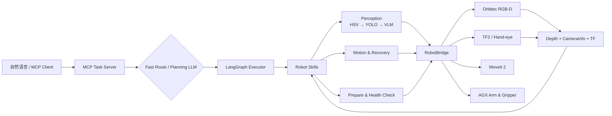

<div align="center">

<h1>Vision Grasp</h1>

<p><strong>自然语言驱动的真实机械臂视觉抓取系统</strong></p>

<p>
ROS 2 Jazzy · MoveIt 2 · Orbbec RGB-D · HSV / YOLO / VLM · LangGraph · MCP
</p>

[](https://docs.ros.org/en/jazzy/)
[](https://www.python.org/)
[](https://moveit.picknik.ai/)
[](#运行环境)
[](#license)

</div>

`vision_grasp` 将自然语言任务转换为可验证的机械臂技能流水线，并在真实七轴
AGX 机械臂上完成物体定位、抓取、放置、场景扫描和基础交互动作。

```text
"抓取红色物块并放回原位置"

prepare → go_home → locate → grasp → place
```

> [!IMPORTANT]
> 这是面向特定真实硬件的实验性项目，不是开箱即用的通用抓取框架。执行前必须
> 核对机械臂型号、TF、工作空间、桌面高度、TCP/指尖距离和急停能力，并先以低速
> 验证。

## 目录

- [核心能力](#核心能力)
- [系统架构](#系统架构)
- [运行环境](#运行环境)
- [快速开始](#快速开始)
- [使用方式](#使用方式)
- [感知与三维定位](#感知与三维定位)
- [运动规划与安全默认值](#运动规划与安全默认值)
- [配置](#配置)
- [OctoMap](#octomap)
- [手眼标定](#手眼标定)
- [测试与诊断](#测试与诊断)
- [故障排查](#故障排查)
- [项目结构](#项目结构)
- [当前限制](#当前限制)

## 核心能力

- **自然语言任务执行**：通过 MCP 暴露高层工具，将中文或英文任务编排为
  LangGraph 技能流水线。
- **分层感知**：纯色目标优先使用 HSV；普通物体按需加载 YOLO；检测失败时可
  使用 VLM 进行语义兜底。
- **RGB-D 三维定位**：将检测框、注册深度、CameraInfo 和手眼 TF 转换为
  `base_link` 下的抓取坐标。
- **确定性动作执行**：LLM 只负责规划技能序列，工作空间检查、下降、夹爪控制、
  重试和恢复由确定性代码执行。
- **性能优先的默认配置**：YOLO 延迟加载、RGB-D 按需订阅、OctoMap 默认关闭、
  MCP 启动默认不修改 MoveIt PlanningScene。
- **运行时诊断**：提供准备阶段健康检查、深度测试、调试图、OctoMap 开关、
  机械臂状态查询和紧急停止接口。
- **统一手眼标定入口**：同一 Launch 启动 Orbbec 去畸变图像、ArUco 和
  easy_handeye2。

## 系统架构



职责边界：

| 层 | 目录 | 职责 |
|---|---|---|
| MCP API | `mcp_server/task_server.py` | 对外工具定义、参数校验和服务生命周期 |
| 编排 | `mcp_server/orchestrator/` | 快速路由、LLM 规划、LangGraph 状态与重试 |
| 技能 | `mcp_server/skills/` | 定位、抓取、放置、恢复和交互动作 |
| 原子组件 | `mcp_server/components/` | 感知、运动、基础设施操作 |
| ROS 适配 | `mcp_server/ros/` | 相机、TF、MoveIt、硬件、OctoMap 和进程管理 |
| 门面 | `mcp_server/ros_bridge.py` | 统一线程安全 ROS 接口和生命周期 |

## 运行环境

当前项目按以下环境开发和验证：

| 项目 | 当前环境 |
|---|---|
| 操作系统 | Ubuntu 24.04 |
| ROS | ROS 2 Jazzy |
| Python | Python 3.12 |
| 运动规划 | MoveIt 2 |
| 机械臂 | AGX Nero 七轴机械臂 |
| 末端执行器 | AGX Gripper |
| 深度相机 | Orbbec DaBai DC1，眼在手上 |
| 手眼标定 | easy_handeye2 + ArUco |
| 推理 | HSV、Ultralytics YOLO、OpenAI-compatible VLM API |

工作空间还需要以下 ROS 包：

| 包 | 作用 | 是否必需 |
|---|---|---|
| `agx_arm_ctrl` / `agx_arm_moveit` | 机械臂控制、MoveIt 和 RViz | 必需 |
| `orbbec_camera` | RGB-D 相机驱动 | 必需 |
| `easy_handeye2` | 发布相机到机械臂的标定 TF | 必需 |
| `aruco_ros` | 手眼标定时检测标定板 | 仅标定 |
| `pcl_filter` | 点云过滤和 OctoMap 门控 | 可选 |

## 快速开始

以下命令假定工作空间为 `~/ros2_ws`，项目位于
`~/ros2_ws/src/vision_grasp`。

### 1. 安装系统依赖

```bash
sudo apt update
sudo apt install \
  python3-venv \
  ros-jazzy-cv-bridge \
  ros-jazzy-tf2-ros-py \
  ros-jazzy-tf2-geometry-msgs
```

如果工作空间依赖声明完整，也可以运行：

```bash
cd ~/ros2_ws
rosdep install --from-paths src --ignore-src -r -y
```

### 2. 创建 Python 环境

```bash
cd ~/ros2_ws/src/vision_grasp
python3 -m venv .venv
source .venv/bin/activate
pip install --upgrade pip
pip install -r requirements.txt
```

### 3. 编译

`easy_handeye2` 在当前 Jazzy/Python 3.12 环境中应使用普通安装构建。不要对它使用
`--symlink-install`，否则可能只生成 `.egg-link`，导致
`PackageNotFoundError: easy-handeye2`。

```bash
cd ~/ros2_ws
source /opt/ros/jazzy/setup.bash

# 首次部署时，先构建工作空间中的硬件与感知依赖
colcon build --packages-up-to \
  agx_arm_ctrl \
  agx_arm_moveit \
  orbbec_camera \
  aruco_ros \
  pcl_filter

colcon build \
  --packages-select easy_handeye2 \
  --allow-overriding easy_handeye2

colcon build \
  --packages-select vision_grasp \
  --symlink-install \
  --allow-overriding vision_grasp

source install/setup.bash
```

### 4. 配置模型与 API

复制本地启动脚本：

```bash
cd ~/ros2_ws/src/vision_grasp
cp scripts/run_mcp.example.sh scripts/run_mcp.sh
chmod +x scripts/run_mcp.sh
```

编辑 `scripts/run_mcp.sh`：

1. 将所有 `/home/[User_name]` 替换为实际路径；
2. 填写 `VLM_API_KEY`；
3. 填写 `PLANNING_LLM_API_KEY`；
4. 根据服务商设置 API URL 和模型名。

```bash
export VLM_API_KEY="..."
export PLANNING_LLM_API_KEY="..."
```

当前 `test.task_test` 会在任务开始时创建 `VlmClient`，因此即使纯色物块最终只使用
HSV，也必须提供有效的 `VLM_API_KEY`。规划模型 Key 用于无法命中快速路由的复杂
任务。

YOLO 权重不提交到 Git。首次使用 YOLO 前，将 `yolov8s.pt` 放到 `models/`，或
设置自定义路径：

```bash
export YOLO_MODEL_PATH="$HOME/models/yolov8s.pt"

# 没有可用 CUDA 时
export YOLO_DEVICE=cpu
```

`scripts/run_mcp.sh`、`.env` 和运行时密钥已设计为仅保存在本机。不要将真实密钥
提交到 Git。

### 5. 准备 CAN

```bash
sudo ip link set can0 type can bitrate 1000000
sudo ip link set can0 up
ip link show can0
```

### 6. 启动基础节点

推荐在调试阶段分别使用三个终端启动，便于定位问题。

机械臂、MoveIt 和 RViz：

```bash
source ~/ros2_ws/install/setup.bash
ros2 launch agx_arm_ctrl start_single_agx_arm_moveit.launch.py \
  can_port:=can0 \
  arm_type:=nero \
  effector_type:=agx_gripper \
  tcp_offset:='[0.0, 0.0, -0.0235, 0.0, 0.0, 0.0]'
```

相机：

```bash
source ~/ros2_ws/install/setup.bash
ros2 launch orbbec_camera dabai.launch.py \
  publish_tf:=false \
  depth_registration:=true
```

手眼标定 TF：

```bash
source ~/ros2_ws/install/setup.bash
ros2 launch easy_handeye2 publish.launch.py \
  name:=my_eih_calib_park
```

`prepare` 也可以自动检查并启动缺失节点，但手动启动更适合首次部署和故障排查。

### 7. 运行第一个任务

```bash
cd ~/ros2_ws/src/vision_grasp
source ~/ros2_ws/install/setup.bash
source .venv/bin/activate

python -m test.task_test "抓取红色物块"
```

预期执行路径：

```text
prepare → go_home → locate → grasp
```

## 使用方式

### 自然语言任务测试

```bash
python -m test.task_test "抓取红色物块"
python -m test.task_test "抓取水瓶并放回原位置"
python -m test.task_test "把蓝色物块放到红色物块右边"
python -m test.task_test "扫描桌面"
python -m test.task_test "打开夹爪"
python -m test.task_test "回到home"
```

指定标定结果：

```bash
python -m test.task_test "抓取红色物块" \
  --calib-name my_eih_calib_park
```

查看可用技能和 Few-shot 示例：

```bash
python -m test.task_test --list
```

### 启动 MCP Server

```bash
cd ~/ros2_ws/src/vision_grasp
scripts/run_mcp.sh
```

服务器使用 `stdio` 传输，供支持 MCP 的客户端作为本地进程启动。

当前对外工具：

| 工具 | 作用 |
|---|---|
| `arm_execute_task` | 执行自然语言任务 |
| `arm_prepare` | 检查或启动机械臂、相机和手眼 TF |
| `arm_get_status` | 返回关节、夹爪、抓取参数和健康状态 |
| `arm_configure_octomap` | 运行时打开或关闭 OctoMap |
| `arm_configure_vlm` | 更新 VLM、YOLO 阈值和 VLM fallback |
| `arm_stop` | 取消当前跟踪的运动目标 |
| `arm_reset_context` | 清空软件保存的持物和动作上下文 |

示例 MCP 调用：

```json
{
  "name": "arm_execute_task",
  "arguments": {
    "task": "抓取红色物块并放回原位置"
  }
}
```

## 感知与三维定位

### 检测级联

```text
纯色目标：HSV
其他目标：HSV（若包含颜色）→ YOLO → VLM
```

| 检测器 | 特点 | 典型目标 |
|---|---|---|
| HSV | 快、像素边界稳定、无需模型 | 红/蓝/绿/黄等纯色物块 |
| YOLO | 本地推理、按需加载、支持常见物体 | 水瓶、杯子、书、剪刀 |
| VLM | 语义能力强，但依赖网络和 API | YOLO 无法映射的复杂描述 |

YOLO 使用 `LazyYoloDetector`，只有任务实际需要 YOLO 时才加载权重。RGB-D 图像也
只在 `prepare`、定位或扫描期间订阅，取得同步帧后立即取消订阅，避免规划阶段持续
进行 MJPEG 解码和整图复制。

### 三维坐标语义

感知输出的 `x / y / z` 位于 `base_link`：

- `x / y`：目标抓取参考点的平面坐标；
- `z`：物体顶部表面，而不是物体中心或 TCP 高度；
- `geometry.local_desk_z`：物体附近拟合的桌面高度；
- `geometry.size`：已知或测得的物体尺寸；
- `geometry.height_source`：高度来源。

对于红外表面深度不可靠的已知彩色物块，系统会拟合物体周围桌面，并使用：

```text
object_surface_z = local_desk_z + color_block_height
```

普通物体则使用检测框内部有效深度的中值和渐进 ROI 回退。

抓取 TCP 高度：

```text
fingertip_z = object_surface_z - fingertip_depth
grasp_z     = fingertip_z + flange_to_tip
```

## 运动规划与安全默认值

项目采用“默认不向 MoveIt 添加额外障碍物”的策略：

- OctoMap 默认关闭；
- 桌面碰撞 BOX 默认关闭；
- 不创建人工 `target_object`；
- 不修改目标物体 ACM；
- MCP 进程启动本身不会向 PlanningScene 添加世界物体；
- `prepare` 在 OctoMap 关闭时会请求清除 MoveIt 中残留的占用体素；
- 桌面高度仍作为数值下限，防止物理指尖下降到桌面以下；
- 失败后尝试恢复到安全高度，并在任务失败路径回到 Home；
- 夹爪宽度反馈用于估计是否持物。

> [!WARNING]
> `arm_stop` 只能取消由本进程跟踪的 ROS Action 目标，不能替代机械急停、驱动急停
> 或断电保护。

## 配置

主配置文件：

```text
config/robot.yaml
```

修改后需要重启 MCP 或测试进程。

### 关键参数

| 参数 | 默认值 | 含义 |
|---|---:|---|
| `planning_group` | `arm` | MoveIt 规划组 |
| `tcp_link` | `tcp_link` | 规划使用的末端连杆 |
| `base_frame` | `base_link` | 三维坐标与规划基坐标 |
| `workspace_x_min/max` | `-0.55 / 0.25` m | X 工作空间 |
| `workspace_y_min/max` | `-0.55 / 0.20` m | Y 工作空间 |
| `approach_height` | `0.26` m | 物体表面到预抓位的高度 |
| `safe_height` | `0.40` m | 抬升与恢复安全高度 |
| `flange_to_tip` | `0.1733` m | TCP/法兰到物理指尖距离 |
| `fingertip_depth` | `0.04` m | 指尖从物体顶面向下进入的距离 |
| `color_block_height` | `0.05` m | 已知彩色物块高度 |
| `planning_time` | `5.0` s | 单次 MoveIt 规划时间 |
| `num_planning_attempts` | `2` | MoveIt 规划尝试次数 |
| `cartesian_min_fraction` | `0.95` | 笛卡尔路径最低完整度 |
| `desk_z_surface` | `-0.013` m | 指尖安全钳制使用的桌面高度 |
| `desk_collision_enabled` | `false` | 是否添加桌面 PlanningScene BOX |
| `octomap_enabled_on_prepare` | `false` | Prepare 后是否启用 OctoMap |
| `home_joints_deg` | 7 个角度 | Home 关节位置 |

如果物理指尖偏低，应先校验手眼标定、`desk_z_surface` 和
`flange_to_tip`，再以 `0.005 m` 为步长调整 `fingertip_depth`。不要通过随意修改
感知物体 Z 来掩盖标定误差。

### 环境变量

| 变量 | 用途 | 默认值 |
|---|---|---|
| `VLM_API_KEY` | VLM API Key | 无 |
| `VLM_API_URL` | OpenAI-compatible VLM endpoint | 启动脚本示例值 |
| `VLM_MODEL` | VLM 模型名 | 启动脚本示例值 |
| `PLANNING_LLM_API_KEY` | 任务规划模型 API Key | 无 |
| `PLANNING_LLM_API_URL` | 规划模型 endpoint | 启动脚本示例值 |
| `PLANNING_LLM_MODEL` | 规划模型名 | 启动脚本示例值 |
| `YOLO_MODEL_PATH` | YOLO 权重路径 | `models/yolov8s.pt` |
| `YOLO_DEVICE` | YOLO 设备 | `cuda` |
| `YOLO_CONFIDENCE` | YOLO 置信度阈值 | `0.35` |
| `VLM_FALLBACK` | 是否允许 VLM 兜底 | `true` |
| `VISION_GRASP_ROBOT_CONFIG` | 覆盖机器人 YAML 路径 | `config/robot.yaml` |
| `VISION_GRASP_TMP_DIR` | 运行时文件根目录 | `tmp/` |
| `VLM_DEBUG_DIR` | 检测调试图目录 | `tmp/debug/` |

## OctoMap

OctoMap 是可选功能，默认不启动，以优先保证 RViz 响应和规划速度。

点云链路：

```text
/camera/depth_registered/points
  → /cloud_downsampled
  → /filtered_cloud
  → octomap_cloud_gate
  → /octomap_cloud
  → MoveIt PointCloudOctomapUpdater
```

任务测试中启用：

```bash
python -m test.task_test "抓取红色物块" --octomap
```

也可以手动启动点云链路：

```bash
ros2 launch pcl_filter pcl_filter.launch.py \
  input_cloud:=/camera/depth_registered/points \
  voxel_leaf:=0.02 \
  octomap_enabled:=true
```

明确关闭：

```bash
python -m test.task_test "抓取红色物块" --no-octomap
```

MCP 运行时接口：

```json
{"name": "arm_configure_octomap", "arguments": {"enabled": true}}
{"name": "arm_configure_octomap", "arguments": {"enabled": false}}
```

ROS 接口：

```bash
ros2 service call /octomap/set_enabled std_srvs/srv/SetBool "{data: true}"

ros2 service call /octomap/set_enabled std_srvs/srv/SetBool "{data: false}"
ros2 service call /clear_octomap std_srvs/srv/Empty "{}"
```

注意事项：

- OctoMap 与 PlanningScene 中的命名碰撞物体不是同一机制；
- 给人工 `target_object` 设置 ACM 不能屏蔽目标位置的 OctoMap 体素；
- 开启 OctoMap 后，目标自身的体素可能阻止最终接近；
- 当前代码不会自动在下降阶段暂停 OctoMap，需要按任务需求显式关闭或清除。

## 手眼标定

### 统一标定 Launch

标定前：

1. 启动机械臂和 `robot_state_publisher`；
2. 停止普通相机 Launch；
3. 停止已有 `handeye_publisher`；
4. 不要单独启动 `aruco_single`。

然后运行：

```bash
source ~/ros2_ws/install/setup.bash
ros2 launch vision_grasp handeye_calibrate.launch.py \
  name:=my_eih_calib_new \
  marker_id:=582 \
  marker_size:=0.0476
```

当前仓库中的 `launch/handeye_calibrate.launch.py` 是指向
`~/ros2_ws/handeye_calibrate.launch.py` 的符号链接。构建前必须确认工作空间根
目录下的源文件存在；仅复制 `vision_grasp` 子目录时，标定 Launch 不具备可移植性。

统一 Launch 会启动：

- Orbbec 相机；
- `/camera/color/image_undistorted`；
- ArUco 单标记检测；
- easy_handeye2 标定服务和 RQt 界面。

采样前检查：

```bash
ros2 topic hz /camera/color/image_undistorted
ros2 topic hz /aruco_single/result
ros2 param get /aruco_single image_is_rectified
ros2 param get /aruco_single marker_size
ros2 run tf2_ros tf2_echo camera_color_optical_frame marker
```

`marker_size` 表示 ArUco 黑色正方形外边缘，不包含白边。当前使用的实测值为
`0.0476 m`。

每次移动机械臂后等待相机、机械臂和标记 TF 完全稳定再采样。建议覆盖不同位置、
距离和多轴旋转，而不是只做平移。

保存结果后，文件位于：

```text
~/.ros2/easy_handeye2/calibrations/<name>.calib
```

### 发布与评估

退出标定 Launch 后发布结果：

```bash
ros2 launch easy_handeye2 publish.launch.py \
  name:=my_eih_calib_new
```

启动评估：

```bash
ros2 launch easy_handeye2 evaluate.launch.py \
  name:=my_eih_calib_new
```

也可以固定标定板，移动机械臂到多个姿态并观察：

```bash
ros2 run tf2_ros tf2_echo base_link marker
```

标定板没有移动时，`base_link → marker` 应保持稳定。几厘米级变化无法满足精确
抓取，应检查相机去畸变、marker 尺寸、采样时间同步、机械臂 TF 和采样姿态分布。

## 测试与诊断

### 无硬件单元测试

```bash
cd ~/ros2_ws/src/vision_grasp
source /opt/ros/jazzy/setup.bash
source .venv/bin/activate
pytest -q test/unit
```

### 端到端任务测试

```bash
python -m test.task_test "抓取红色物块并放回原位置"
```

输出包括：

- 任务流水线；
- 感知来源和三维坐标；
- 抓取 TCP/指尖高度；
- 笛卡尔路径完整度；
- 失败步骤、是否可重试和恢复结果；
- 总耗时和持物状态。

### 深度与局部桌面测试

```bash
python -m test.depth_test 红色物块
```

输出包括物体深度、`base_link` 坐标、四周桌面深度、局部桌面高度、物体高度和
调试图路径。

### 调试图

```text
tmp/debug/       # HSV、YOLO、VLM 检测图
tmp/depth_test/  # 深度诊断图
```

`tmp/` 已被 `.gitignore` 忽略。

## 故障排查

| 现象 | 优先检查 |
|---|---|
| `Target outside workspace` | `base_link → camera` TF、标定名称、工作空间范围 |
| 抓取 X/Y 固定偏移 | 手眼标定；固定标定板后检查 `base_link → marker` 多姿态稳定性 |
| 物体 Z 明显错误 | `python -m test.depth_test`、深度注册、局部桌面拟合 |
| `/aruco_single/result` 无图 | `/camera/color/image_undistorted` 帧率和 ArUco remap |
| `PackageNotFoundError: easy-handeye2` | 不使用 `--symlink-install`，单独普通构建 easy_handeye2 |
| `dummy_publisher is still running` | 退出 `handeye_calibrate.launch.py` 后再执行任务 |
| 规划突然变慢、RViz 卡顿 | OctoMap/点云节点、残留 PlanningScene、重复 `move_group` |
| `cartesian path only ... reachable` | 目标可达性、桌面/OctoMap 碰撞、抓取姿态和路径阈值 |
| 重复节点检查失败 | 停止多余的 MoveIt、机械臂或 handeye launch |
| YOLO 首次检测慢 | 首次调用会延迟加载 CUDA 模型，纯色目标不会加载 YOLO |

常用 ROS 检查：

```bash
ros2 node list
ros2 topic list
ros2 topic hz /camera/color/image_raw
ros2 topic hz /camera/depth/image_raw
ros2 run tf2_ros tf2_echo base_link camera_color_optical_frame
ros2 action list
ros2 service list | grep planning_scene
```

## 项目结构

```text
vision_grasp/
├── config/
│   └── robot.yaml                  # 机器人、抓取和规划参数
├── launch/
│   └── handeye_calibrate.launch.py # 指向工作空间根目录 Launch 的符号链接
├── mcp_server/
│   ├── components/                 # 感知、运动、基础设施原子能力
│   ├── config/                     # 路径、运行时和 YAML 加载
│   ├── models/                     # 结果与几何数据模型
│   ├── orchestrator/               # 规划器和 LangGraph 执行器
│   ├── perception/                 # HSV 与调试绘制
│   ├── ros/                        # Camera/TF/MoveIt/OctoMap/Bringup
│   ├── skills/                     # 任务技能与恢复逻辑
│   ├── api_services.py             # 管理型 MCP handler
│   ├── ros_bridge.py               # ROS 门面和生命周期
│   ├── task_server.py              # MCP stdio 服务入口
│   ├── vlm_client.py               # VLM HTTP 客户端
│   └── yolo_detector.py            # YOLO 与延迟加载
├── models/
│   └── yolov8s.pt                  # 本地 YOLO 权重，不提交 Git
├── scripts/
│   └── run_mcp.example.sh          # 不含真实密钥的启动模板
├── test/
│   ├── unit/                       # 无硬件单元测试
│   ├── depth_test.py               # 深度与桌面诊断
│   └── task_test.py                # 自然语言端到端测试
├── tmp/                            # 运行时输出，不提交 Git
├── package.xml
├── requirements.txt
└── setup.py
```

## 当前限制

- 当前硬件和参数针对 AGX Nero + AGX Gripper + Orbbec DaBai DC1；
- 抓取姿态为固定下抓，不包含通用六自由度抓取姿态估计；
- 已知彩色物块高度依赖 `color_block_height` 配置；
- YOLO 默认模型受其训练类别限制；
- VLM 和规划 LLM 依赖外部 OpenAI-compatible API；
- OctoMap 开启后不会自动为最终抓取接近暂停体素更新；
- 统一标定 Launch 当前依赖工作空间根目录中的源文件；
- MCP `needs_input` 会话恢复接口尚未实现；
- 软件急停不能替代物理急停。

## License

项目元数据当前声明为 MIT。正式对外分发前，还应在仓库中补充完整的 `LICENSE`
文件。
